# 如何下载或更新 Mixin Messenger？

- 我是安卓（Android）用户

    Google Play 下载链接： https://play.google.com/store/apps/details?id=one.mixin.messenger

    APK 下载链接： https://dl.mixinpay.com/mixin-android-3.0.0.apk

    华为手机，可以用 “夸克” 浏览器 app。

  [安装 Mixin 遇到风险提示怎么办？](https://support.mixin.one/zh/article/mixin-kvgk6r/)

  **如果下载不了或者下载很慢请尝试切换 Wi-Fi 和 4G/5G 网络，还不行请尝试使用 VPN，VPN 需要开全局。**

- 我是苹果（iOS）用户

  
    您需要使用非中国大陆地区、非英国的 Apple ID 才能下载或更新 Mixin Messenger。如果您没有符合的 Apple ID，请参考以下教程注册一个，注册地选香港和美国都可以：

  **[如何申请非中国大陆地区 Apple ID？](https://support.mixin.one/zh/article/apple-id-1lynya6/)**
    如果您切换账号仍然无法下载请尝试：
    重启设备
    重新切换，先退出当前账号然后登录过中国大陆地区的账号，然后再退出登录再登录非中国大陆地区账号。
  **如果切换账号后 App Store 的语言没有变化那说明切换失败了，请尝试重新切换账号。**删除重装，如果您之前安装过 Mixin，且之前的 Apple ID 不能用了，您不能用新的 Apple ID 覆盖安装，只能删除重装，苹果不允许这种操作。
    确认设备系统版本，Mixin 要求 iOS 15 或更高系统，如果您的设备没有升级到 iOS 15 或更高，也无法下载，可以从设备的 **设置 > 通用 > 软件更新**，先更新系统到最新版后再尝试。

# mixin基础教程：

## Mixin注册

​	第一次打开MiXin的界面，点击创建帐户。

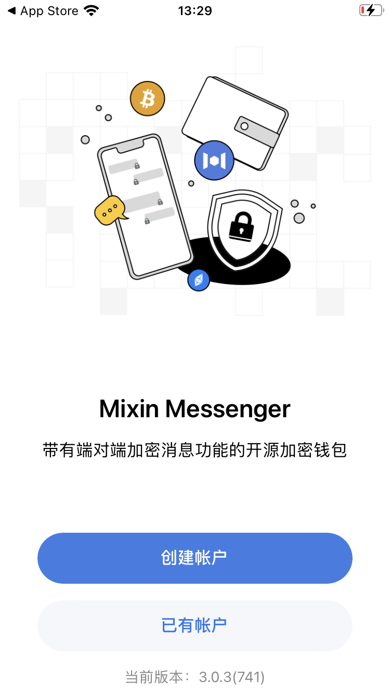

​	点击之后会有两个选项。第一个选项，是通过手机号进行创建。第二个选项是通过助记词。	

​	助记词：是一组按照特定顺序排列的**12个、15个、18个或24个英文单词**。它们可以用来生成和恢复整个加密货币钱包。

​	建议新手，使用第一个选项通过手机号码。

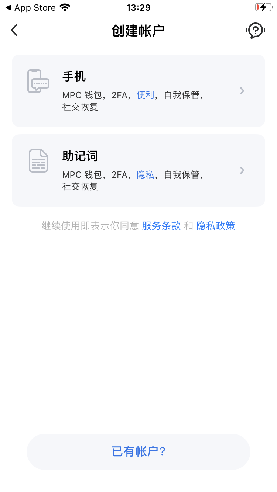

​	输入手机号码，获取验证码。

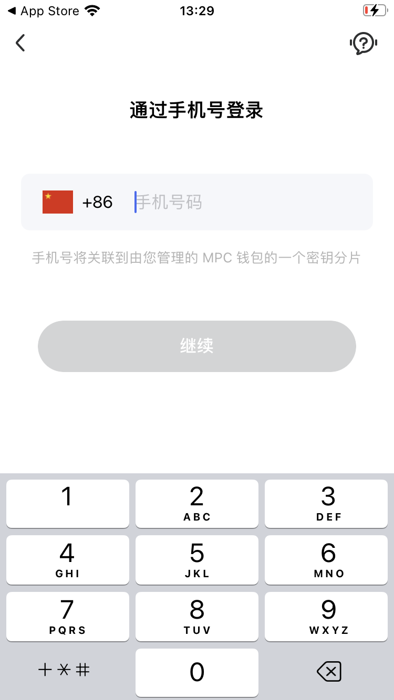

​	输入你的昵称，随便输入都可以

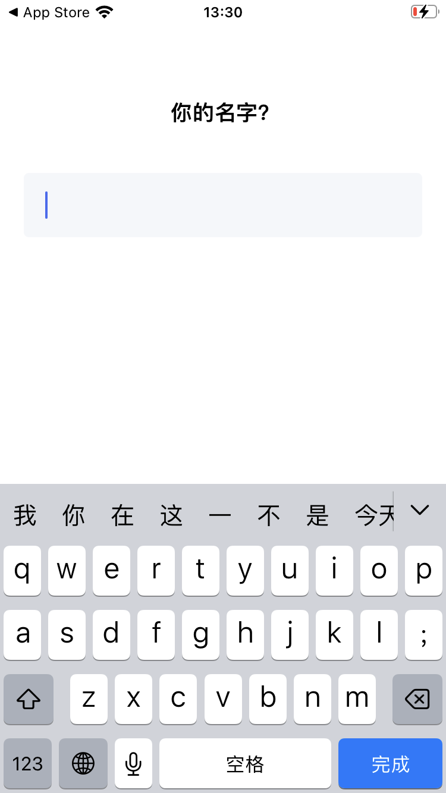

​	PIN码极其重要！！！！ 这是你的钱包钥匙，你的登录凭证，一定要记住，忘记了，就没办法了。

​	题外话：现在mixin有服务，可以恢复。具体需要了解一下。

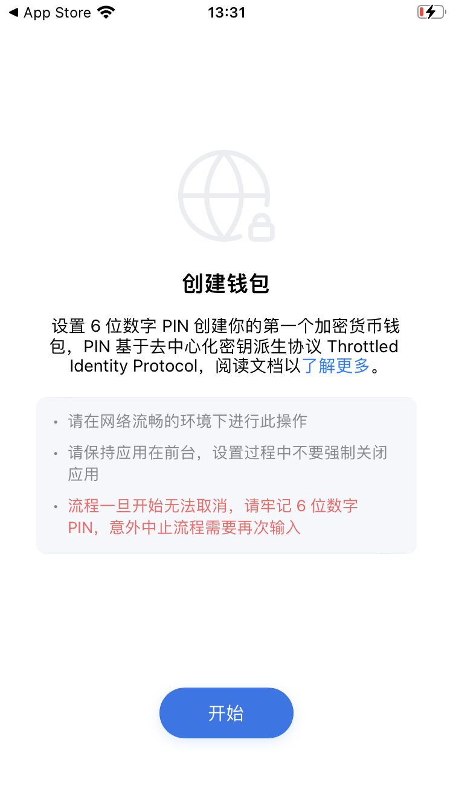

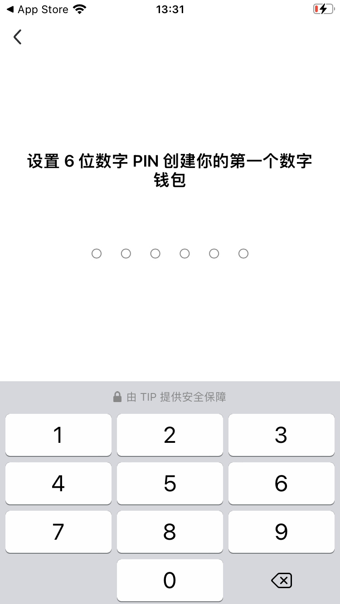

​	多输入几次，确保自己记住整个密码！！！！！很重要！！！！

​	至此，MiXin完全注册成功！

---

## mixin基础知识

mixin官方客服号：7000

首先，mixin中没有小程序的概念，都是一个个机器人。

### 注册成功后，进入的页面。

​	下方有四个标签，第一个聊天，也就是你曾经沟通过的联系人都在这里，跟微信一样。

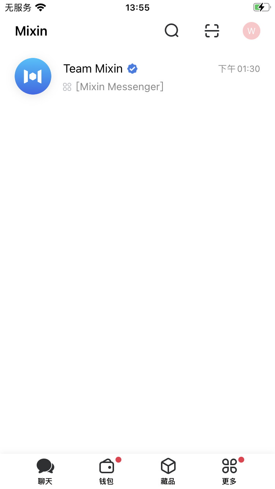

第二个钱包，是你购买数字货币显示的界面。

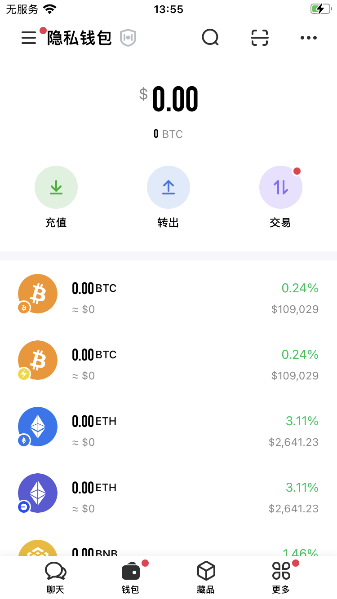

第三个藏品，不过多深入了解。

第四个：更多。

左上角有两个选项，机器人就是你添加过的机器人，可以是大群，也可以是个人。

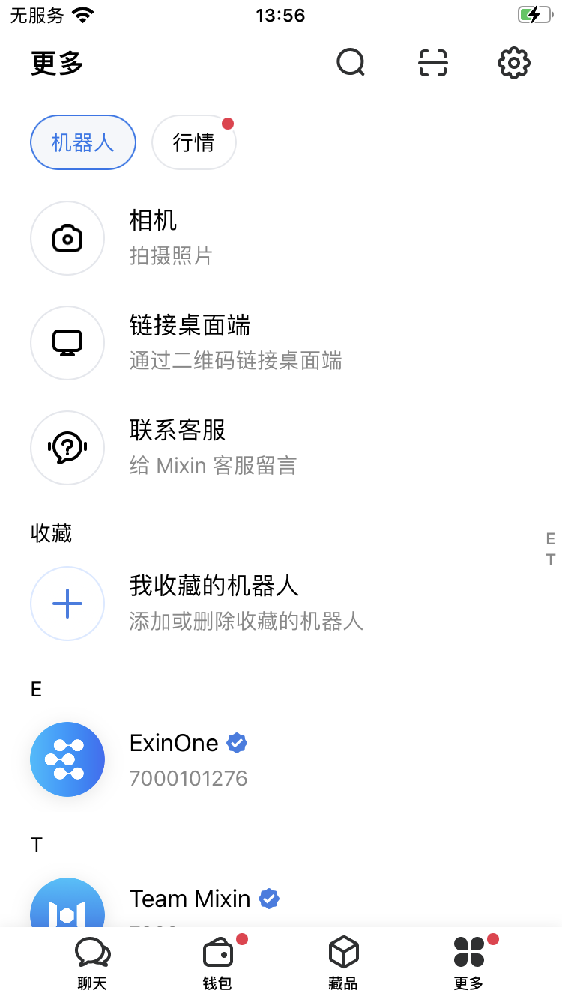

行情：可以看各个币的走势，以及当前价格。

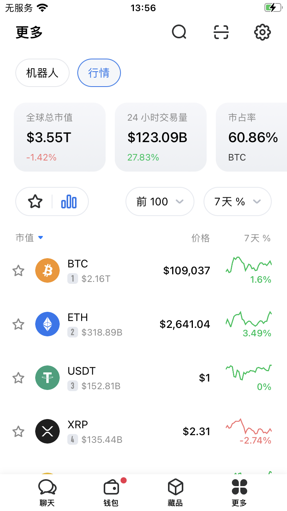

### 机器人内部结构

​	点击机器人进入后，可在对话框输入内容，发送对方收到发送的消息记录会显示蓝色双钩。

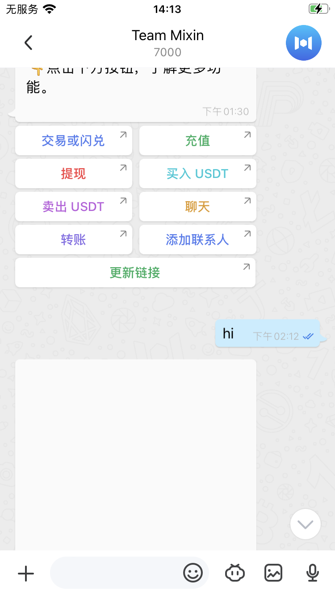

向前翻显示历史聊天记录

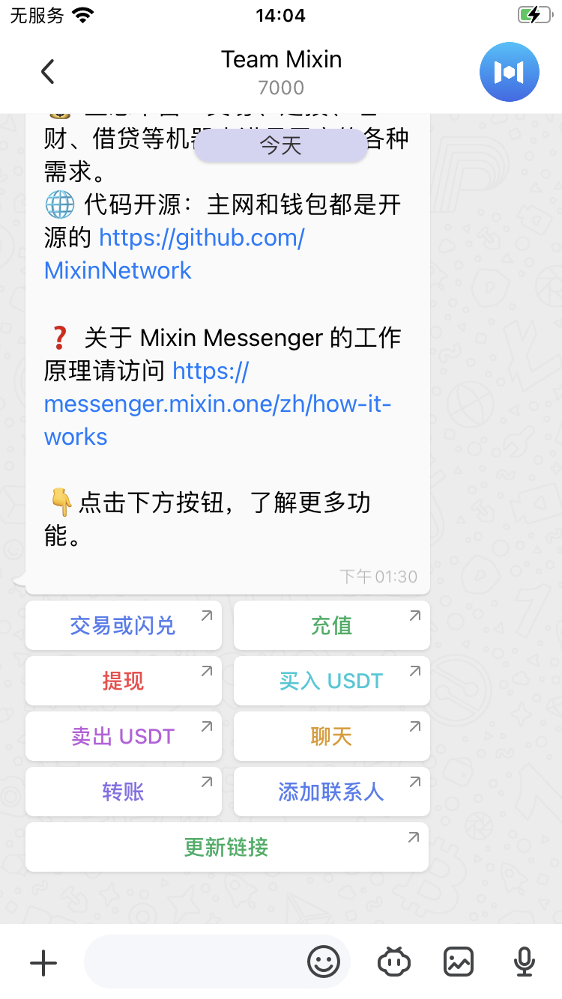

点击猪鼻子，跳转机器人的内部页面。这个是重要的功能。

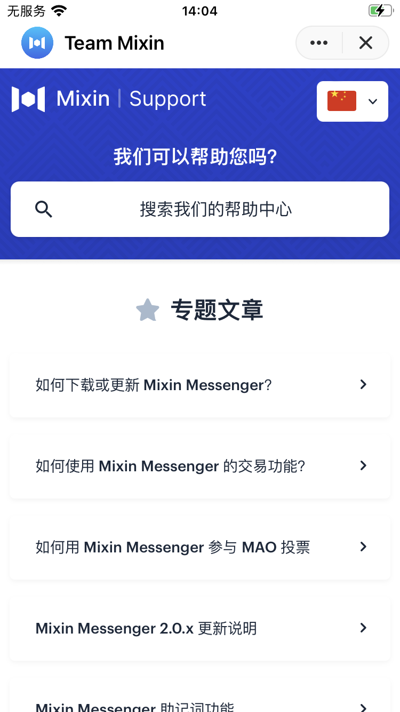

点击右上角图标，也会有部份功能。可自行摸索

### 如何找到对方与人沟通

常用ID号：

官方Team 7000

TIGA-safe 7000104225

ExinOne 7000101276

Pando 7000105018

水龙头APP 7000000014

Mixin Route 7000105155

在顶部搜索🔍按钮中输入对方的ID。即可查找到对方。

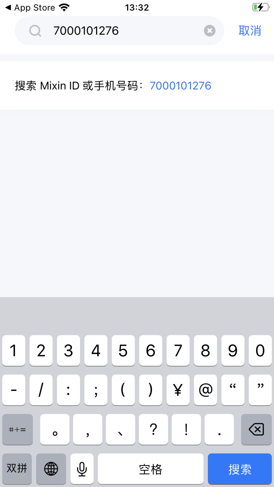

找到对方后，即可发送消息对方聊天